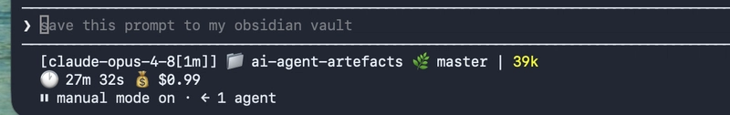

# AI Agent Artefacts

A collection of AI-related artefacts for agent workflows, including reusable
skills, instructions, and supporting documentation.

## Contents

- [Skills](skills/README.md) — reusable, manually invoked Claude Code skills.

## Claude Code configuration

The [`.claude/`](.claude/) directory contains my preferred Claude Code
settings and interface customizations:

- [`settings.json`](.claude/settings.json) — project-level permissions and
  feature preferences.
- [`statusline-command.sh`](.claude/statusline-command.sh) — a two-line,
  color-coded status line showing the model, working directory, Git branch and
  dirty state, token usage, session duration, and cost.

The settings expect the status-line script at
`~/.claude/statusline-command.sh`; copy or link the script there when using
these settings on another machine.